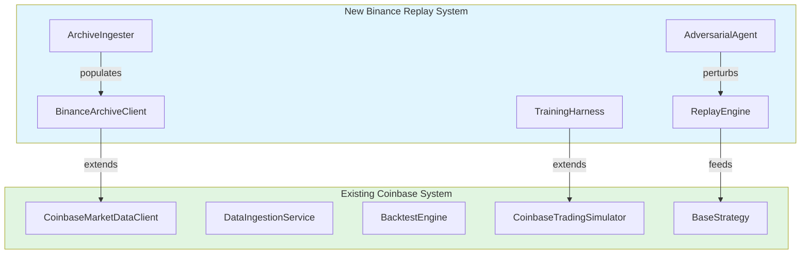
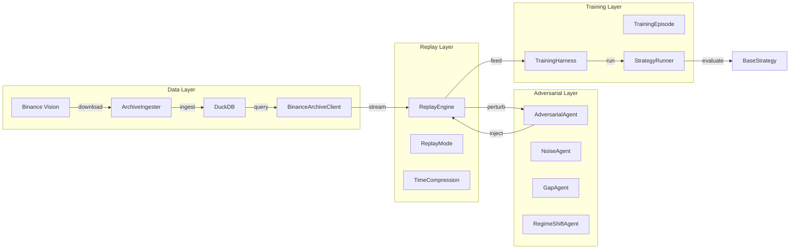
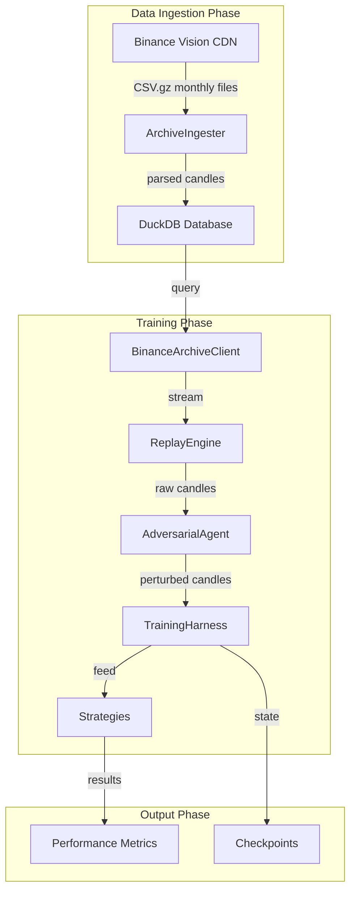
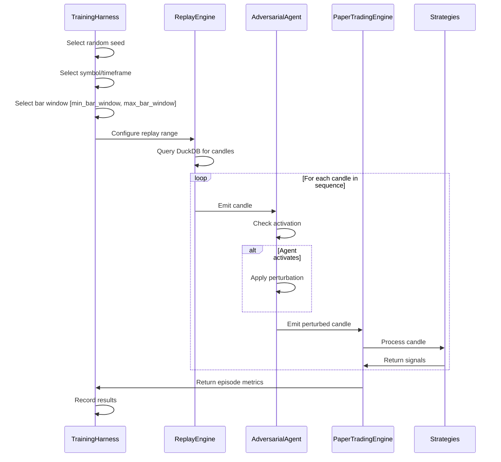
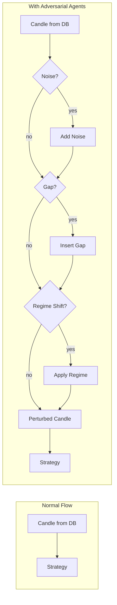
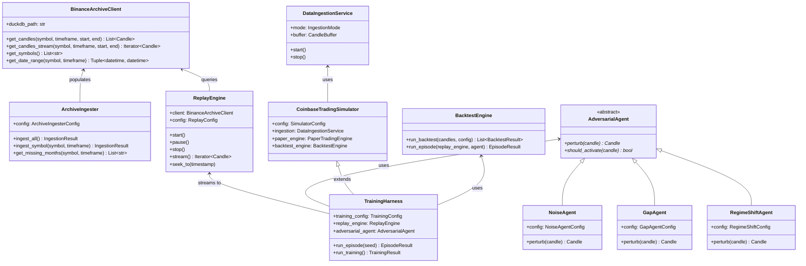
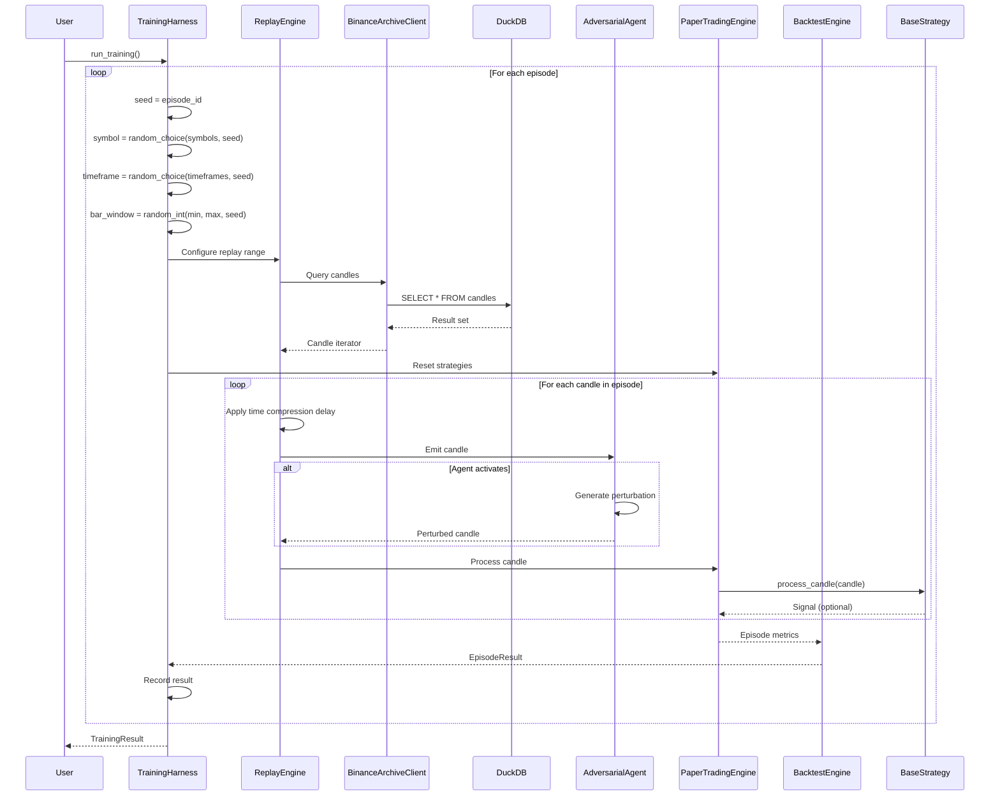

# Binance Archive Replay + Adversarial Agent Training System

## Architecture Document

**Version:** 1.0
**Date:** 2026-03-02
**Status:** Design Complete

---

## 1. System Overview

### 1.1 Goals

The Binance Archive Replay + Adversarial Agent Training system extends the existing Coinbase-focused paper trading simulator to support:

1. **High-Throughput Historical Replay**: Stream historical candle data from Binance Vision archives at configurable speeds (real-time to 1000x compression)
2. **Adversarial Training**: Inject market perturbations (noise, gaps, regime shifts) to train robust strategies
3. **Scalable Data Access**: DuckDB-based storage for efficient querying of multi-year, multi-symbol historical data
4. **Deterministic Reproducibility**: Seed-based randomization ensures reproducible training episodes
5. **Integration with Existing Codebase**: Seamlessly extend current `DataIngestionService`, `BacktestEngine`, and `CoinbaseTradingSimulator`

### 1.2 Key Capabilities

| Capability | Description |
|------------|-------------|
| Archive Ingestion | Download and ingest Binance Vision CSV.gz monthly archives |
| Compressed Replay | Replay years of data in minutes with time compression |
| Adversarial Injection | Noise agents, gap agents, regime shift agents |
| Episode-Based Training | Configurable episodes with bar sequences per episode |
| Determinism | Seed-based reproducibility for scientific rigor |
| DuckDB Storage | Columnar storage for efficient historical queries |

### 1.3 Integration with Existing System



---

## 2. Core Components

### 2.1 Component Architecture



### 2.2 BinanceArchiveClient

**Purpose**: DuckDB-based client for efficient historical data access.

**Location**: `backend/src/binance_client.py` (extends pattern from `coinbase_client.py`)

**Key Responsibilities**:
- Connect to DuckDB database configured in `coordination/config.toml`
- Query candles by symbol, timeframe, date range
- Support efficient range queries for replay streaming
- Cache query results for repeated access

**Interface**:
```python
class BinanceArchiveClient:
    def __init__(self, duckdb_path: Optional[str] = None)
    def get_candles(
        self,
        symbol: str,
        timeframe: Timeframe,
        start: datetime,
        end: datetime
    ) -> List[Candle]
    def get_candles_stream(
        self,
        symbol: str,
        timeframe: Timeframe,
        start: datetime,
        end: datetime
    ) -> Iterator[Candle]
    def get_symbols() -> List[str]
    def get_date_range(symbol: str, timeframe: Timeframe) -> Tuple[datetime, datetime]
    def validate_symbols(symbols: List[str]) -> List[str]
```

**DuckDB Schema**:
```sql
CREATE TABLE candles (
    symbol VARCHAR,
    timeframe VARCHAR,
    timestamp TIMESTAMP,
    open DOUBLE,
    high DOUBLE,
    low DOUBLE,
    close DOUBLE,
    volume DOUBLE,
    PRIMARY KEY (symbol, timeframe, timestamp)
);

CREATE INDEX idx_symbol_timeframe ON candles(symbol, timeframe, timestamp);
```

### 2.3 ArchiveIngester

**Purpose**: Download and ingest Binance Vision CSV.gz files into DuckDB.

**Location**: `backend/src/archive_ingester.py`

**Key Responsibilities**:
- Download monthly CSV.gz archives from `https://data.binance.vision`
- Parse CSV format: `open_time,open,high,low,close,volume,close_time,quote_volume,count,taker_buy_volume,taker_buy_quote_volume,ignore`
- Convert timestamps and ingest into DuckDB
- Handle incremental updates (only download missing months)
- Manage temporary file cleanup

**Interface**:
```python
@dataclass
class ArchiveIngesterConfig:
    base_url: str = "https://data.binance.vision/data/spot/monthly/klines"
    cache_dir: str = "/Users/jim/work/moneyfan/data/binance/archive_cache"
    duckdb_path: str = "/Users/jim/work/moneyfan/data/binance/hrm_data.duckdb"
    symbols: List[str] = field(default_factory=list)
    timeframes: List[str] = field(default_factory=lambda: ["1m", "5m", "1h"])
    start_month: str = "2020-01"
    end_month: Optional[str] = None

class ArchiveIngester:
    def __init__(self, config: ArchiveIngesterConfig)
    def ingest_all() -> IngestionResult
    def ingest_symbol(symbol: str, timeframe: str) -> IngestionResult
    def get_available_months(symbol: str, timeframe: str) -> List[str]
    def get_ingested_months(symbol: str, timeframe: str) -> List[str]
    def get_missing_months(symbol: str, timeframe: str) -> List[str]
```

**CSV Processing Pipeline**:
```
Download CSV.gz → Decompress → Parse CSV → Validate → Transform → Bulk Insert → Cleanup
```

### 2.4 ReplayEngine

**Purpose**: High-throughput streaming engine with configurable time compression.

**Location**: `backend/src/replay_engine.py`

**Key Responsibilities**:
- Stream candles from DuckDB at configurable speeds
- Support multiple replay modes (real-time, compressed, step-through)
- Coordinate multi-symbol replay with synchronized timestamps
- Emit candles to registered callbacks
- Support pause/resume/stop controls

**Interface**:
```python
class ReplayMode(Enum):
    REALTIME = "realtime"           # 1x speed
    COMPRESSED = "compressed"       # Nx speed (configurable)
    STEP_THROUGH = "step_through"   # Manual stepping
    INSTANT = "instant"             # No delay (max throughput)

@dataclass
class ReplayConfig:
    mode: ReplayMode = ReplayMode.COMPRESSED
    compression_factor: float = 100.0  # 100x = 1 hour in 36 seconds
    symbols: List[str] = field(default_factory=list)
    timeframes: List[Timeframe] = field(default_factory=lambda: [Timeframe.ONE_HOUR])
    start_date: Optional[datetime] = None
    end_date: Optional[datetime] = None
    seed: Optional[int] = None

class ReplayEngine:
    def __init__(
        self,
        client: BinanceArchiveClient,
        config: ReplayConfig
    )
    def start() -> None
    def pause() -> None
    def resume() -> None
    def stop() -> None
    def step() -> Optional[Candle]           # For step-through mode
    def register_candle_callback(callback: Callable[[Candle], None])
    def get_progress() -> ReplayProgress
    def seek_to(timestamp: datetime) -> None
```

**Time Compression Algorithm**:
```python
def calculate_sleep_time(
    candle_interval_seconds: int,
    compression_factor: float
) -> float:
    return candle_interval_seconds / compression_factor
```

### 2.5 AdversarialAgent

**Purpose**: Base class and implementations for injecting market perturbations.

**Location**: `backend/src/adversarial_agents.py`

**Key Responsibilities**:
- Define base interface for adversarial agents
- Implement noise injection (price/volume jitter)
- Implement gap simulation (flash crashes, pumps)
- Implement regime shift simulation (volatility changes, trend reversals)
- Support agent composition (multiple agents can stack)

**Interface**:
```python
class AdversarialAgent(ABC):
    @abstractmethod
    def perturb(self, candle: Candle) -> Candle

    @abstractmethod
    def should_activate(self, candle: Candle) -> bool

    @property
    @abstractmethod
    def name(self) -> str

@dataclass
class NoiseAgentConfig:
    price_jitter_pct: float = 0.001  # 0.1% price noise
    volume_jitter_pct: float = 0.05  # 5% volume noise
    activation_probability: float = 0.3
    seed: Optional[int] = None

class NoiseAgent(AdversarialAgent):
    def __init__(self, config: NoiseAgentConfig)
    def perturb(self, candle: Candle) -> Candle
    def should_activate(self, candle: Candle) -> bool

@dataclass
class GapAgentConfig:
    gap_probability: float = 0.001    # 0.1% chance per candle
    gap_magnitude_range: Tuple[float, float] = (0.02, 0.10)  # 2-10%
    direction_bias: float = 0.5       # 0.5 = symmetric, 0 = down only, 1 = up only
    seed: Optional[int] = None

class GapAgent(AdversarialAgent):
    def __init__(self, config: GapAgentConfig)
    def perturb(self, candle: Candle) -> Candle
    def should_activate(self, candle: Candle) -> bool

@dataclass
class RegimeShiftConfig:
    shift_probability: float = 0.0001  # 0.01% chance per candle
    volatility_multiplier_range: Tuple[float, float] = (0.5, 3.0)
    trend_reversal_probability: float = 0.3
    duration_range: Tuple[int, int] = (50, 200)  # candles
    seed: Optional[int] = None

class RegimeShiftAgent(AdversarialAgent):
    def __init__(self, config: RegimeShiftConfig)
    def perturb(self, candle: Candle) -> Candle
    def should_activate(self, candle: Candle) -> bool
    def is_active() -> bool
```

**Agent Composition**:
```python
class CompositeAgent(AdversarialAgent):
    def __init__(self, agents: List[AdversarialAgent])
    def perturb(self, candle: Candle) -> Candle:
        for agent in self.agents:
            if agent.should_activate(candle):
                candle = agent.perturb(candle)
        return candle
```

### 2.6 TrainingHarness

**Purpose**: Orchestrate replay, adversarial agents, and strategy evaluation.

**Location**: `backend/src/training_harness.py`

**Key Responsibilities**:
- Extend `CoinbaseTradingSimulator` for training mode
- Manage training episodes with configurable parameters
- Coordinate replay engine with adversarial agents
- Track episode metrics and strategy performance
- Support curriculum learning (progressive difficulty)

**Interface**:
```python
@dataclass
class TrainingConfig:
    episodes: int = 100000
    bar_sequences_per_episode: int = 100
    min_bar_window: int = 64
    max_bar_window: int = 256
    candles_per_extent: int = 1500
    max_training_seconds: int = 3600
    pair_width: int = 24

    # Adversarial settings
    enable_adversarial: bool = True
    noise_config: Optional[NoiseAgentConfig] = None
    gap_config: Optional[GapAgentConfig] = None
    regime_config: Optional[RegimeShiftConfig] = None

    # Replay settings
    replay_mode: ReplayMode = ReplayMode.INSTANT
    compression_factor: float = 1000.0

@dataclass
class EpisodeResult:
    episode_id: int
    seed: int
    start_time: datetime
    end_time: datetime
    symbol: str
    timeframe: Timeframe
    start_idx: int
    end_idx: int
    strategy_results: List[StrategyResult]
    adversarial_events: List[AdversarialEvent]

class TrainingHarness:
    def __init__(
        self,
        replay_engine: ReplayEngine,
        paper_engine: PaperTradingEngine,
        config: TrainingConfig
    )
    def run_training() -> TrainingResult
    def run_episode(
        episode_id: int,
        seed: int,
        symbol: str,
        timeframe: Timeframe
    ) -> EpisodeResult
    def get_progress() -> TrainingProgress
    def pause_training()
    def resume_training()
    def stop_training()
    def save_checkpoint(path: str)
    def load_checkpoint(path: str)
```

---

## 3. Data Flow

### 3.1 High-Level Data Flow



### 3.2 Episode Data Flow



### 3.3 Adversarial Injection Flow



---

## 4. Key Design Decisions

### 4.1 Storage: DuckDB for Historical Data

**Decision**: Use DuckDB as the primary storage for historical candle data.

**Rationale**:
- Columnar storage enables fast analytical queries
- Efficient compression reduces storage footprint
- SQL interface simplifies data access patterns
- Single-file database simplifies deployment
- Excellent Python integration

**Trade-offs**:
- | Pros | Cons |
  |------|------|
  | Fast analytical queries | Not distributed (single-node) |
  | Efficient compression | Limited concurrent writes |
  | SQL interface | Requires schema management |
  | Single-file portability | Memory-mapped performance on large datasets |

### 4.2 Replay Modes

**Decision**: Support four distinct replay modes for different use cases.

| Mode | Use Case | Delay Calculation |
|------|----------|-------------------|
| REALTIME | Live simulation testing | `interval_seconds` |
| COMPRESSED | Training with human oversight | `interval / compression_factor` |
| STEP_THROUGH | Debugging, analysis | Manual trigger |
| INSTANT | Maximum throughput training | `0` |

### 4.3 Determinism and Reproducibility

**Decision**: Implement seed-based reproducibility for all random operations.

**Requirements**:
- Episode seeds control: symbol selection, timeframe selection, start index, bar window size
- Agent seeds control: activation decisions, perturbation magnitudes
- Global seed for overall training run

**Implementation**:
```python
class SeededRandom:
    def __init__(self, seed: int):
        self.rng = random.Random(seed)

    def choice(self, options: List[T]) -> T:
        return self.rng.choice(options)

    def randint(self, min: int, max: int) -> int:
        return self.rng.randint(min, max)

    def random(self) -> float:
        return self.rng.random()
```

### 4.4 Agent Architecture

**Decision**: Composable agent pattern allowing multiple perturbations to stack.

**Rationale**:
- Single-responsibility agents are easier to test and debug
- Composition enables complex scenarios from simple building blocks
- Order of application matters (documented in configuration)

### 4.5 Integration Strategy

**Decision**: Extend existing classes rather than replace them.

**Pattern**:
- `BinanceArchiveClient` follows same interface pattern as `CoinbaseMarketDataClient`
- `TrainingHarness` extends `CoinbaseTradingSimulator`
- `IngestionMode.REPLAY` added to existing `IngestionMode` enum
- `BacktestEngine.run_episode()` added alongside `run_backtest()`

---

## 5. Integration Points

### 5.1 DataIngestionService Extension

**Location**: `backend/src/data_ingestion.py`

**Changes**:
```python
class IngestionMode(str, Enum):
    LIVE = "live"
    BACKTEST = "backtest"
    HYBRID = "hybrid"
    REPLAY = "replay"  # NEW

class DataIngestionService:
    def __init__(self, config: IngestionConfig = None):
        # ... existing code ...
        self.replay_engine: Optional[ReplayEngine] = None

    async def start(self):
        if self.config.mode == IngestionMode.REPLAY:
            await self._start_replay_mode()
        # ... existing code ...

    async def _start_replay_mode(self):
        """Start in replay mode using Binance archive data."""
        client = BinanceArchiveClient()
        replay_config = ReplayConfig(
            symbols=self.config.symbols,
            timeframes=self.config.timeframes,
            mode=ReplayMode.COMPRESSED,
            compression_factor=100.0,
        )
        self.replay_engine = ReplayEngine(client, replay_config)
        self.replay_engine.register_candle_callback(self._on_new_candle)
        await self.replay_engine.start()
```

### 5.2 BacktestEngine Extension

**Location**: `backend/src/backtesting.py`

**Changes**:
```python
class BacktestEngine:
    # ... existing code ...

    def run_episode(
        self,
        replay_engine: ReplayEngine,
        adversarial_agent: Optional[AdversarialAgent] = None,
        config: BacktestConfig = None
    ) -> EpisodeResult:
        """
        Run a single training episode with replay and optional adversarial injection.

        This extends the batch-based backtest to support streaming replay
        with real-time perturbations.
        """
        episode_signals = []
        episode_candles = []

        for candle in replay_engine.stream():
            # Apply adversarial perturbation if agent provided
            if adversarial_agent and adversarial_agent.should_activate(candle):
                candle = adversarial_agent.perturb(candle)

            episode_candles.append(candle)

            # Process through all strategies
            for strategy in self.strategies:
                signal = strategy.process_candle(candle)
                if signal:
                    episode_signals.append(signal)

        return EpisodeResult(
            candles=episode_candles,
            signals=episode_signals,
            # ... other fields
        )
```

### 5.3 CoinbaseTradingSimulator Extension

**Location**: `backend/src/training_harness.py`

**Implementation**:
```python
class TrainingHarness(CoinbaseTradingSimulator):
    """
    Extended simulator for adversarial training with Binance archive replay.

    Extends the base simulator to support:
    - Episode-based training loops
    - Adversarial agent injection
    - Time-compressed replay
    - Curriculum learning
    """

    def __init__(
        self,
        config: SimulatorConfig = None,
        training_config: TrainingConfig = None
    ):
        super().__init__(config)
        self.training_config = training_config or TrainingConfig()
        self.replay_engine: Optional[ReplayEngine] = None
        self.adversarial_agent: Optional[AdversarialAgent] = None
        self.episode_results: List[EpisodeResult] = []

    def initialize_replay(
        self,
        symbols: List[str],
        timeframes: List[Timeframe],
        start_date: datetime,
        end_date: datetime
    ):
        """Initialize the replay engine with Binance archive data."""
        client = BinanceArchiveClient()
        replay_config = ReplayConfig(
            symbols=symbols,
            timeframes=timeframes,
            start_date=start_date,
            end_date=end_date,
            mode=self.training_config.replay_mode,
            compression_factor=self.training_config.compression_factor,
        )
        self.replay_engine = ReplayEngine(client, replay_config)

        # Initialize adversarial agent if enabled
        if self.training_config.enable_adversarial:
            self.adversarial_agent = self._create_composite_agent()

    def run_episode(self, seed: int) -> EpisodeResult:
        """Run a single training episode."""
        # Use seeded random for reproducibility
        rng = SeededRandom(seed)

        # Randomly select parameters for this episode
        symbol = rng.choice(self.config.symbols)
        timeframe = rng.choice(self.config.timeframes)
        bar_window = rng.randint(
            self.training_config.min_bar_window,
            self.training_config.max_bar_window
        )

        # Configure replay for this episode
        # ... (seek to random start, set window size)

        # Run the episode
        return self.backtest_engine.run_episode(
            replay_engine=self.replay_engine,
            adversarial_agent=self.adversarial_agent,
        )

    def run_training(self) -> TrainingResult:
        """Run the full training loop."""
        start_time = datetime.now(timezone.utc)

        for episode_id in range(self.training_config.episodes):
            seed = episode_id  # Or use global seed + episode_id
            result = self.run_episode(seed)
            self.episode_results.append(result)

            # Check for training timeout
            elapsed = (datetime.now(timezone.utc) - start_time).seconds
            if elapsed > self.training_config.max_training_seconds:
                logger.info(f"Training timeout reached after {episode_id} episodes")
                break

        return TrainingResult(
            episodes=self.episode_results,
            total_episodes=len(self.episode_results),
            duration_seconds=elapsed,
        )
```

---

## 6. File Structure

### 6.1 New Files

| File | Description | Key Classes |
|------|-------------|-------------|
| `backend/src/binance_client.py` | DuckDB-based archive client | `BinanceArchiveClient` |
| `backend/src/archive_ingester.py` | Download and ingest archives | `ArchiveIngester`, `ArchiveIngesterConfig` |
| `backend/src/replay_engine.py` | High-throughput replay | `ReplayEngine`, `ReplayConfig`, `ReplayMode` |
| `backend/src/adversarial_agents.py` | Adversarial perturbations | `AdversarialAgent`, `NoiseAgent`, `GapAgent`, `RegimeShiftAgent` |
| `backend/src/training_harness.py` | Training orchestration | `TrainingHarness`, `TrainingConfig`, `EpisodeResult` |

### 6.2 Modified Files

| File | Changes |
|------|---------|
| `backend/src/data_ingestion.py` | Add `IngestionMode.REPLAY`, replay mode initialization |
| `backend/src/backtesting.py` | Add `run_episode()` method for streaming replay |
| `backend/src/models.py` | Add `EpisodeResult`, `TrainingResult` dataclasses |

### 6.3 Directory Structure

```
backend/
├── src/
│   ├── __init__.py
│   ├── main.py
│   ├── models.py                    # + EpisodeResult, TrainingResult
│   ├── indicators.py
│   ├── strategies.py
│   ├── coinbase_client.py
│   ├── binance_client.py            # NEW
│   ├── archive_ingester.py          # NEW
│   ├── data_ingestion.py            # MODIFIED
│   ├── replay_engine.py             # NEW
│   ├── adversarial_agents.py        # NEW
│   ├── paper_trading.py
│   ├── backtesting.py               # MODIFIED
│   ├── bullpen.py
│   ├── simulator.py
│   ├── training_harness.py          # NEW
│   └── tests/
│       ├── test_simulator.py
│       ├── test_binance_client.py   # NEW
│       ├── test_replay_engine.py    # NEW
│       └── test_adversarial.py      # NEW
├── requirements.txt                 # + duckdb, requests
└── README.md

coordination/
├── config.toml                      # Existing Binance Vision settings
└── runtime/
    └── hrm_training_harness.json    # Training state/checkpoints
```

### 6.4 Module Specifications

#### binance_client.py
```python
"""
Binance Archive Client - DuckDB-based historical data access.

Extends the pattern from coinbase_client.py to provide efficient
querying of historical candle data stored in DuckDB.
"""

import duckdb
from typing import List, Optional, Iterator, Tuple
from datetime import datetime
from .models import Candle, Timeframe

class BinanceArchiveClient:
    """
    Client for querying Binance historical data from DuckDB.

    SAFETY: This client is read-only. It cannot modify the database.
    """

    def __init__(self, duckdb_path: Optional[str] = None):
        # Use path from config.toml if not provided
        pass

    def get_candles(self, symbol: str, timeframe: Timeframe,
                    start: datetime, end: datetime) -> List[Candle]:
        """Query candles for a specific symbol and timeframe."""
        pass

    def get_candles_stream(self, symbol: str, timeframe: Timeframe,
                           start: datetime, end: datetime) -> Iterator[Candle]:
        """Stream candles one at a time for memory efficiency."""
        pass
```

#### archive_ingester.py
```python
"""
Archive Ingester - Download and ingest Binance Vision CSV files.

Downloads monthly CSV.gz files from Binance Vision and ingests
them into DuckDB for efficient querying.
"""

import requests
import gzip
import csv
from pathlib import Path
from typing import List
from datetime import datetime
import duckdb

class ArchiveIngester:
    """
    Handles downloading and ingesting Binance Vision archives.

    Supports incremental updates - only downloads missing months.
    """

    BASE_URL = "https://data.binance.vision/data/spot/monthly/klines"

    def ingest_all(self) -> IngestionResult:
        """Ingest all configured symbols and timeframes."""
        pass

    def _download_month(self, symbol: str, timeframe: str,
                        year: int, month: int) -> Path:
        """Download a single month's archive file."""
        pass

    def _ingest_csv(self, csv_path: Path, symbol: str,
                    timeframe: str) -> int:
        """Parse CSV and insert into DuckDB. Returns row count."""
        pass
```

#### replay_engine.py
```python
"""
Replay Engine - High-throughput historical data streaming.

Streams candles from DuckDB at configurable speeds, supporting
real-time, compressed, and step-through replay modes.
"""

import asyncio
import time
from typing import Iterator, Optional, Callable, List
from datetime import datetime
from enum import Enum
from .models import Candle, Timeframe
from .binance_client import BinanceArchiveClient

class ReplayMode(Enum):
    REALTIME = "realtime"
    COMPRESSED = "compressed"
    STEP_THROUGH = "step_through"
    INSTANT = "instant"

class ReplayEngine:
    """
    Streams historical candles at configurable speeds.

    Supports both synchronous and asynchronous iteration.
    """

    def __init__(self, client: BinanceArchiveClient, config: ReplayConfig):
        pass

    def stream(self) -> Iterator[Candle]:
        """Synchronous streaming generator."""
        pass

    async def stream_async(self):
        """Asynchronous streaming with proper timing."""
        pass

    def seek_to(self, timestamp: datetime) -> None:
        """Seek to a specific timestamp in the replay."""
        pass
```

#### adversarial_agents.py
```python
"""
Adversarial Agents - Market perturbation for robust training.

Implements various adversarial agents that inject noise, gaps,
and regime shifts into the candle stream to train robust strategies.
"""

from abc import ABC, abstractmethod
from dataclasses import dataclass
from typing import Optional, Tuple
from .models import Candle

class AdversarialAgent(ABC):
    """Base class for all adversarial agents."""

    @abstractmethod
    def perturb(self, candle: Candle) -> Candle:
        """Apply perturbation to a candle."""
        pass

    @abstractmethod
    def should_activate(self, candle: Candle) -> bool:
        """Determine if agent should activate for this candle."""
        pass

class NoiseAgent(AdversarialAgent):
    """Adds small random noise to price and volume."""
    pass

class GapAgent(AdversarialAgent):
    """Randomly inserts price gaps (flash crashes/pumps)."""
    pass

class RegimeShiftAgent(AdversarialAgent):
    """Temporarily shifts volatility or trend regime."""
    pass
```

#### training_harness.py
```python
"""
Training Harness - Orchestrates replay + agents + strategies.

Extends CoinbaseTradingSimulator to support episode-based
adversarial training with Binance archive replay.
"""

from typing import List, Optional
from datetime import datetime
from .simulator import CoinbaseTradingSimulator
from .replay_engine import ReplayEngine, ReplayConfig
from .adversarial_agents import AdversarialAgent
from .models import SimulatorConfig

class TrainingHarness(CoinbaseTradingSimulator):
    """
    Extended simulator for adversarial training.

    Orchestrates the training loop:
    1. Select random episode parameters (seeded)
    2. Configure replay engine
    3. Initialize adversarial agents
    4. Run episode
    5. Record results
    """

    def __init__(self, config: SimulatorConfig = None,
                 training_config: TrainingConfig = None):
        super().__init__(config)
        self.training_config = training_config

    def run_episode(self, seed: int) -> EpisodeResult:
        """Run a single training episode."""
        pass

    def run_training(self) -> TrainingResult:
        """Run the full training loop."""
        pass
```

---

## 7. Configuration Integration

### 7.1 Existing Config.toml Sections

The system leverages the existing `[binance_vision]` and `[harness]` sections in `coordination/config.toml`:

```toml
[binance_vision]
base_url = "https://data.binance.vision/data/spot/monthly/klines"
storage_mode = "permanent"
cache_dir_permanent = "/Users/jim/work/moneyfan/data/binance/archive_cache"
duckdb_path_permanent = "/Users/jim/work/moneyfan/data/binance/hrm_data.duckdb"
tmp_root = "/tmp"
tmp_prefix = "curly-binance"
start_month = "2026-01"
symbols = ["BTCUSDT", "ETHUSDT", "SOLUSDT", "BNBUSDT", "XRPUSDT", "ADAUSDT", "DOGEUSDT"]
timeframes = ["1m", "5m", "15m", "1h", "4h", "1d"]

[[harness.stages]]
name = "hrm_24x24"
pair_width = 24
codec_outputs = 24
effective_width = 24
max_training_seconds = 3600
episodes = 100000
bar_sequences_per_episode = 100
min_bar_window = 64
max_bar_window = 256
candles_per_extent = 1500
```

### 7.2 New Configuration Classes

```python
# Loaded from config.toml and extended for training
@dataclass
class BinanceVisionConfig:
    base_url: str
    cache_dir: str
    duckdb_path: str
    symbols: List[str]
    timeframes: List[str]
    start_month: str

@dataclass
class HarnessStageConfig:
    name: str
    pair_width: int
    episodes: int
    bar_sequences_per_episode: int
    min_bar_window: int
    max_bar_window: int
    candles_per_extent: int
    max_training_seconds: int
```

---

## 8. Performance Considerations

### 8.1 Throughput Targets

| Mode | Target Throughput | Use Case |
|------|-------------------|----------|
| INSTANT | 100,000+ candles/sec | Batch training |
| COMPRESSED 1000x | ~280 candles/sec | Fast validation |
| REALTIME | 1 candle/sec (1m) | Live simulation |

### 8.2 Memory Management

- DuckDB handles large datasets via memory-mapped files
- Replay engine uses streaming (Iterator pattern) to avoid loading full history
- Adversarial agents maintain minimal state
- Episode results are persisted to disk, not kept in memory

### 8.3 Parallelization

- Single-symbol replay is single-threaded (maintains temporal ordering)
- Multi-symbol replay uses async for coordination
- Training episodes can be parallelized across multiple harness instances

---

## 9. Testing Strategy

### 9.1 Unit Tests

| Test File | Coverage |
|-----------|----------|
| `test_binance_client.py` | DuckDB queries, edge cases, empty results |
| `test_replay_engine.py` | Timing accuracy, seek operations, multi-symbol sync |
| `test_adversarial.py` | Agent activation, perturbation bounds, composition |
| `test_training_harness.py` | Episode reproducibility, checkpointing, metrics |

### 9.2 Integration Tests

- Full ingestion → replay → training pipeline
- Determinism validation (same seed = same results)
- Performance benchmarks (throughput measurements)

### 9.3 Determinism Validation

```python
def test_episode_reproducibility():
    """Verify that same seed produces identical results."""
    seed = 42

    result1 = harness.run_episode(seed)
    result2 = harness.run_episode(seed)

    assert result1.strategy_results == result2.strategy_results
    assert result1.adversarial_events == result2.adversarial_events
```

---

## 10. Migration Path

### 10.1 Phase 1: Data Infrastructure
1. Implement `ArchiveIngester`
2. Implement `BinanceArchiveClient`
3. Run initial data ingestion

### 10.2 Phase 2: Replay Engine
1. Implement `ReplayEngine` with all modes
2. Extend `DataIngestionService` with REPLAY mode
3. Integration testing with existing strategies

### 10.3 Phase 3: Adversarial Training
1. Implement adversarial agent base classes
2. Implement specific agents (Noise, Gap, Regime)
3. Implement `TrainingHarness`
4. Extend `BacktestEngine` with `run_episode()`

### 10.4 Phase 4: Integration
1. Full system integration testing
2. Performance optimization
3. Documentation and examples

---

## Appendix A: Class Diagram



---

## Appendix B: Sequence Diagram - Full Training Episode



---

**End of Document**
